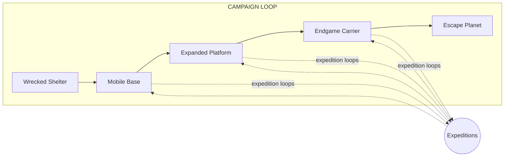
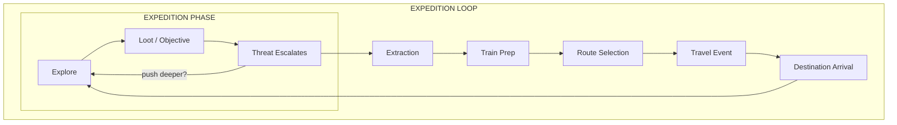
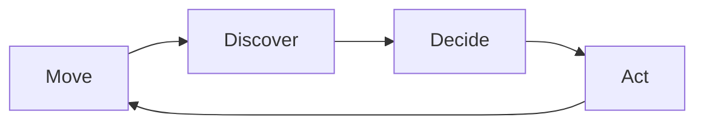

# Core Loop Diagram

Visual representation of the game's nested gameplay loops.

## Campaign Loop (Outer)

The long-term progression arc across a full playthrough.



**States:**
1. **Wrecked Shelter** — Starting condition, immobile, basic survival
2. **Mobile Base** — Train functional, can travel routes
3. **Expanded Platform** — Multiple cars, full systems online
4. **Endgame Carrier** — Advanced capabilities, ready for final push
5. **Escape Planet** — Win condition achieved

---

## Expedition Loop (Core Session)

The primary gameplay cycle that fills most play time.



**Phases:**

### Train Prep
- Repair damage from last expedition
- Craft consumables and gear
- Equip loadouts
- Assign roles and responsibilities
- Review shortages and priorities

### Route Selection
- Choose destination from available nodes
- Weigh risk vs. reward
- Consider fuel costs and hazards
- Strategic campaign decisions

### Travel Event
- Resolve route hazards
- Random encounters
- Monitor train systems
- Prepare for arrival conditions

### Expedition Phase
- Scout and explore destination
- Complete objectives
- Gather resources
- Manage escalating threat
- Decide when to extract

### Extraction
- Fight or evade to train
- Carry recovered resources
- Defend train during departure
- Assess losses and gains

---

## Moment-to-Moment Loop (Inside Expedition)

The second-to-second gameplay within an expedition.



**Cycle:**

| Phase | Activities |
|-------|------------|
| **Move** | Navigate environment, maintain formation, watch sightlines |
| **Discover** | Find loot, spot enemies, identify hazards, locate objectives |
| **Decide** | Fight or evade? Loot or skip? Push or retreat? Split or stay? |
| **Act** | Combat, looting, problem-solving, tool use, communication |

---

## Loop Relationships

```
┌─────────────────────────────────────────────────────────────┐
│ CAMPAIGN LOOP                                               │
│   Progress through train states toward escape               │
│                                                             │
│   ┌─────────────────────────────────────────────────────┐   │
│   │ EXPEDITION LOOP (repeats many times)                │   │
│   │   Prep → Route → Travel → Expedition → Extract      │   │
│   │                                                     │   │
│   │   ┌─────────────────────────────────────────────┐   │   │
│   │   │ MOMENT-TO-MOMENT (continuous)               │   │   │
│   │   │   Move → Discover → Decide → Act            │   │   │
│   │   └─────────────────────────────────────────────┘   │   │
│   └─────────────────────────────────────────────────────┘   │
└─────────────────────────────────────────────────────────────┘
```

## Open Questions

- How long should each expedition loop take in real time? (Target: 30-60 min?)
- What triggers campaign state transitions? Specific milestones or gradual accumulation?
- Should travel events be skippable on safe/cleared routes?
